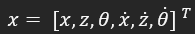
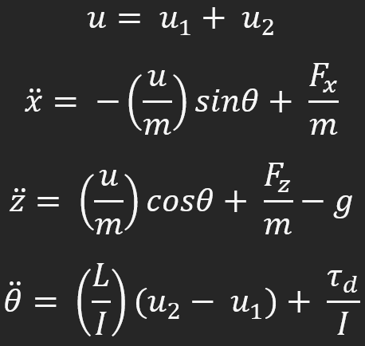
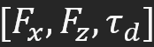
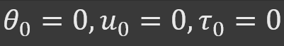

# 2d-quadrotor
2D quadrotor mini-project: nonlinear simulation + LQR hover controller, with flight-data metrics and regression tests.

# 2D Quadrotor GNC (Planar) — Nonlinear RK4 Sim + LQR/LQI + Metrics & Monitors

This repo is a mini-project that implements an end-to-end planar (2D) quadrotor guidance, navigation, and control (GNC) loop:

- **Nonlinear planar quadrotor dynamics** in the x–z plane with pitch angle θ  
- **RK4 fixed-step integration** for time-domain simulation
- **Hover linearization** around θ=0 and u₁+u₂=mg
- **LQR** controller for stabilization
- **LQI (LQR + integral action)** to remove steady-state position error under constant disturbances (e.g., wind)
- **Metrics** (settling time, max error, steady-state error, effort)
- **Integrity monitors** (saturation, bounds, NaN/Inf, windup risk)

The code is structured like a small professional codebase: reusable package code under `src/`, runnable demos under `scripts/`.

---

## Model

### State
The state for the system is:

<p align="center">
  
</p>


### Inputs (actuators)
Two rotor thrusts (Newtons): **u₁** (left) and **u₂** (right).

### Nonlinear dynamics (world frame)
Nonlinear dynamics (world frame):

<p align="center">
  
</p>

Disturbances are optional world-frame forces/torque: 

<p align="center">
  
</p>

### Controller design model (hover linearization)
Linearized about hover: 

<p align="center">
  
</p>

Control input for LQR/LQI design:

These are mixed into rotor thrusts via the mixer:

<p align="center">
  
</p>

where:
- δu = deviation in total thrust from hover
- δτ = deviation in pitch torque from hover

## Project layout

```text
src/planar_quadrotor/
  params.py          # physical constants & limits
  dynamics.py        # nonlinear f(x,u) + hover linearization
  integrators.py     # RK4
  mixer.py           # (du, dtau) -> (u1, u2) + saturation
  controllers.py     # LQR/LQI helpers (CARE solver)
  disturbances.py    # wind step / other disturbance profiles
  sim.py             # open-loop + closed-loop simulation loops
  metrics.py         # performance metrics
  monitors.py        # integrity monitors (sat/bounds/nan/windup)

scripts/
  run_hover_openloop.py
  run_hover_lqr.py
  run_hover_lqi.py
